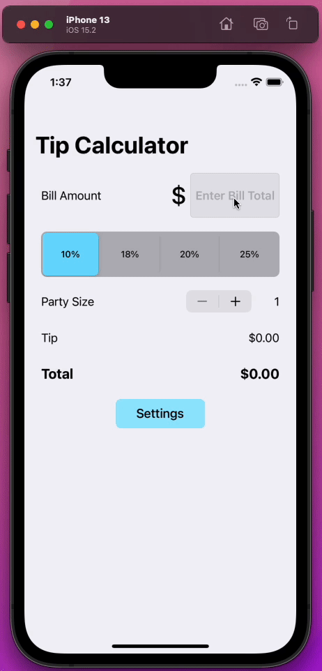

# Pre-work - _Tip Calculator_

**Tip Calculator** is a tip calculator application for iOS.

Submitted by: **Charles Kypros**

Time spent: **5** hours spent in total

## User Stories

The following **required** functionality is complete:

- [x] User can enter a bill amount, choose a tip percentage, and see the tip and total values.
- [x] User can select between tip percentages by tapping different values on the segmented control and the tip value is updated accordingly

The following **optional** features are implemented:

- [x] UI animations
- [ ] Remembering the bill amount across app restarts (if <10mins)
- [ ] Using locale-specific currency and currency thousands separators.
- [ ] Making sure the keyboard is always visible and the bill amount is always the first responder. This way the user doesn't have to tap anywhere to use this app. Just launch the app and start typing.

The following **additional** features are implemented:

- [x] Added Navigation to Settings page
- [x] Allowed user to enter custom tip values that will be selectable within the app
- [x] State is saved across the app by a class and the selectable tip percentages are automatically sorted in ascending order to account for user entered values
- [x] Added Party Size selection from 1 to 99
- [x] If Party Size is greater than 1, an additional Total Per Person value will be displayed. Otherwise it is hidden.
- [x] Organized the UI elements using Stacks and custom Constraints
- [x] Total is automatically re-calculated when the bill amount is changed, when tip percent is changed, or when party size is changed.
- [x] Customized the UI elements to give them a little bit of design.

## Video Walkthrough

Here's a walkthrough of implemented user stories:

## Notes

The development of this app gave me an opportunity to experiment with Storyboard app development in iOS. I referenced creating an App State using the Singleton design pattern to maintain the state across navigation. I learned how to create Stacks to manage my UI elements and how to link UI elements to actions, and how the actions can be shared / reused for more than one element. I also learned how to incorporate page navigation.

## License

    Copyright [2022] [Charles Kypros]

    Licensed under the Apache License, Version 2.0 (the "License");
    you may not use this file except in compliance with the License.
    You may obtain a copy of the License at

        http://www.apache.org/licenses/LICENSE-2.0

    Unless required by applicable law or agreed to in writing, software
    distributed under the License is distributed on an "AS IS" BASIS,
    WITHOUT WARRANTIES OR CONDITIONS OF ANY KIND, either express or implied.
    See the License for the specific language governing permissions and
    limitations under the License.
